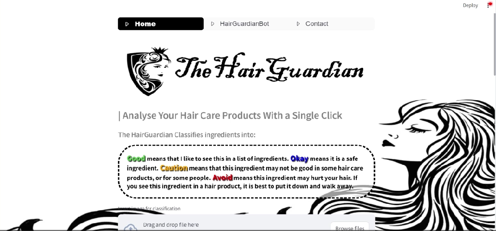
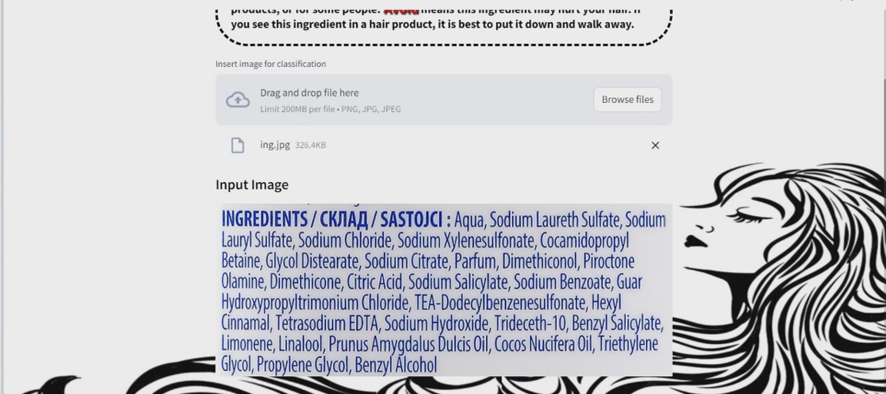
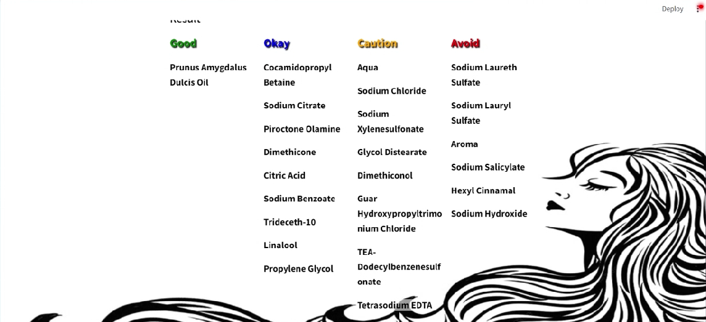
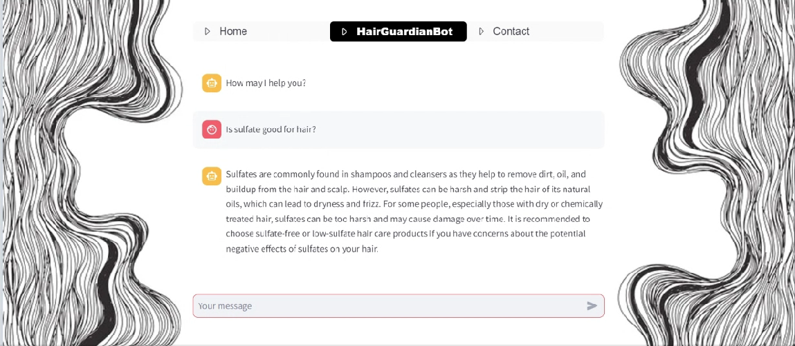
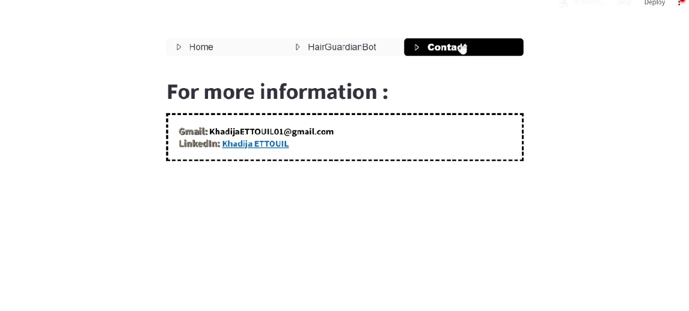

# 'The HairGuardian': Transforming Hair Care Safety with AI

## Empowering Informed Choices

Welcome to 'The HairGuardian' project! Our mission is to empower consumers of hair care products to make informed choices by selecting products with safe ingredients. Additionally, our website offers a chatbot feature that allows users to seek further clarification.

### The Technical Magic Behind It

Here's how it works technically:
- Users upload an image containing the product's list of ingredients.
- We employ Pytesseract to extract the text from these images.
- We leverage the "google/flan-t5-large" model from Hugging Face, fine-tuned using Langchain on multiple PDFs containing information about the safety of chemical ingredients.
- This allows us to categorize ingredients into 'Good,' 'Okay,' 'Caution,' or 'Avoid' based on the extracted text.

### Enhancing the User Experience

To enhance the user experience, we have developed an interactive chatbot called 'HairGuardian,' powered by OpenAI's "gpt-3.5-turbo" API. This chatbot serves as a valuable resource for users, providing instant answers to their questions and concerns.

### User Interface

Finally, the user interface is thoughtfully designed with the assistance of Streamlit.

## How to Run the Project

To run the project locally, follow these steps:

1. Install the required packages:

   ```bash
   pip install chromadb Cython tiktoken pytesseract langchain huggingface_hub sentence_transformers streamlit streamlit_option_menu openai

2. Get API keys from OpenAI and Hugging Face, and add them to the code.
3. To launch the website on localhost, use the following command:
   ```bash
   streamlit run ui.py
That's it! You're ready to explore 'The HairGuardian' project and empower users to make safer choices for their hair care needs.

## Screenshots






